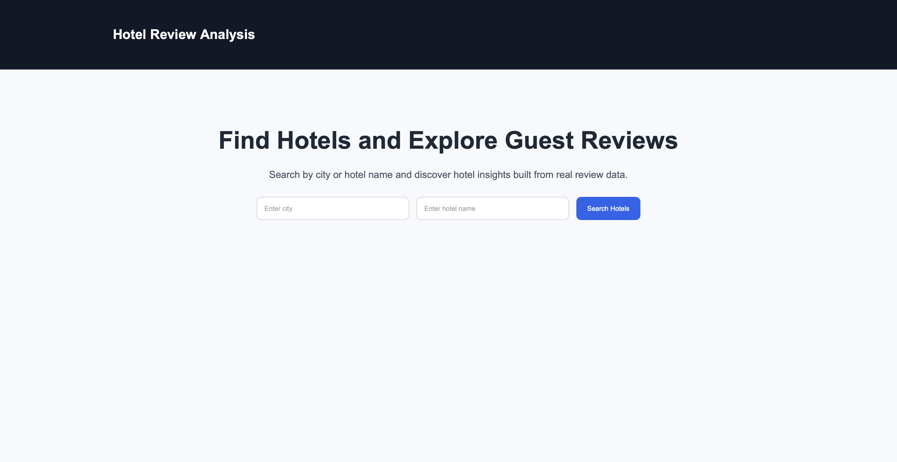
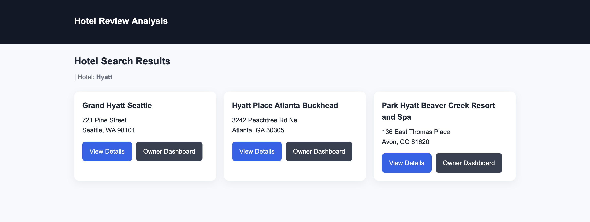
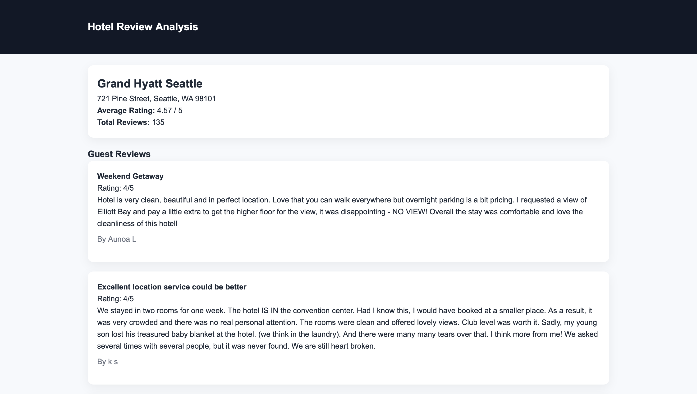
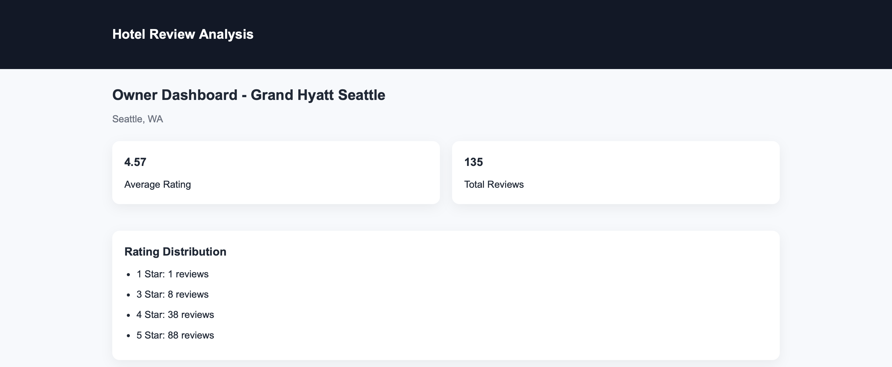
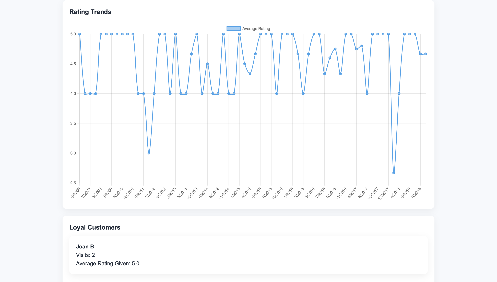
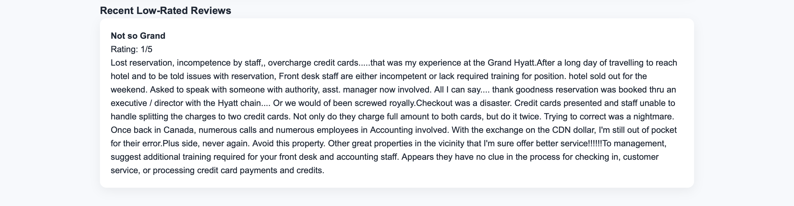

# 🏨 Hotel Review Platform

A full-stack data-driven web application that analyzes hotel reviews to generate actionable insights for both travelers and hotel owners.
Built using **Flask, MongoDB, HTML/CSS**, and deployed on **Render with MongoDB Atlas**.

---

## 🌐 Live Demo

🚀 **Try the application here:**
👉 https://hotel-review-analysis.onrender.com

> Note: The app may take ~30–50 seconds to load initially due to Render's free tier cold start.



---


## 🚀 Overview

This project transforms raw, unstructured hotel review data into meaningful analytics and interactive dashboards.

It supports two core personas:

* **Travelers** → Discover hotels using search, ratings, and reviews
* **Hotel Owners** → Analyze customer feedback, trends, and behavior

The system leverages **MongoDB aggregation pipelines** to power real-time analytics such as rating trends, customer segmentation, and review insights.

---

## 🎯 Project Highlights

* Designed a **data-driven analytics platform** from raw, unstructured review data
* Implemented **advanced MongoDB aggregation pipelines** for trend analysis and segmentation
* Built a **dual-interface system** for both customers and business stakeholders
* Transformed raw text reviews into **actionable business insights**
* Deployed a **production-ready full-stack application** with cloud infrastructure








---

## 📊 Dataset

This project uses a real-world hotel review dataset sourced from **Kaggle**, containing:

* 🏨 Hotel metadata (name, location, categories)
* ⭐ User ratings (1–5 scale)
* 📝 Unstructured review text
* 👤 User information (username, location)
* 📅 Review timestamps

The dataset was preprocessed and split into two collections:

* `hotels` → hotel-level metadata
* `reviews` → individual user reviews linked via `hotelId`

This structure enables efficient querying and advanced analytics using MongoDB aggregation pipelines.


## ✨ Key Features

### 👤 Traveler Experience

* 🔍 Search hotels by city or name
* ⭐ View aggregated ratings and review counts
* 📝 Explore detailed customer reviews
* 📊 Access structured insights from review data

### 🧑‍💼 Owner Analytics Dashboard

* 📈 **Rating trends over time** (monthly aggregation)
* 🔁 **Loyalty detection** (repeat customer analysis)
* 🧠 **Customer segmentation** (Promoters, Neutral, Detractors)
* ⚠️ **Low-rated review monitoring**
* 🧾 **Text-based insights** from unstructured reviews
* 📊 Interactive visualizations using Chart.js

### ⚙️ Backend & Data Capabilities

* MongoDB aggregation pipelines for real-time analytics
* RESTful endpoints serving structured insights
* Scalable NoSQL schema design for high-volume review data

---

## 🏗️ System Architecture

```
Flask (Backend + Templates)
        ↓
MongoDB (Hotels + Reviews Collections)
        ↓
Aggregation Pipelines (Analytics Layer)
        ↓
HTML/CSS + Chart.js (Frontend Dashboard)
        ↓
Render (Deployment) + MongoDB Atlas (Cloud DB)
```
---

## ⚙️ Core Analytics Implemented

### 📈 Rating Trends

* Monthly aggregation using `$group` + `$year` + `$month`

### 🔁 Loyalty Detection

* Identifies repeat users using aggregation pipelines

### 🧠 Customer Segmentation

* Categorizes users into:

  * Promoters (≥4)
  * Neutral (≥3)
  * Detractors (<3)

### 🧾 Text-Based Insights

* Extracts signals from unstructured reviews using `$regexMatch`
* Tracks:

  * Cleanliness mentions
  * Noise complaints
  * Service feedback

---

## 🔌 Backend APIs

| Endpoint                   | Description             |
| -------------------------- | ----------------------- |
| `/hotels`                  | Search hotels           |
| `/hotel/<id>`              | Hotel details + reviews |
| `/owner/<id>`              | Owner dashboard         |
| `/api/owner/<id>/trends`   | Rating trends           |
| `/api/owner/<id>/loyalty`  | Loyal customers         |
| `/api/owner/<id>/segments` | Customer segmentation   |
| `/api/owner/<id>/insights` | Text insights           |

---

## 🧑‍💻 Tech Stack

* **Backend:** Flask, Python
* **Database:** MongoDB (Atlas)
* **Frontend:** HTML, CSS, Chart.js
* **Deployment:** Render
* **Data Processing:** MongoDB Aggregation Pipelines

---

## 📦 Project Structure

```
hotel-review-analysis/
│
├── app.py
├── config.py
├── requirements.txt
│
├── db/
│   └── mongo.py
│
├── routes/
│   ├── user_routes.py
│   └── owner_routes.py
│
├── services/
│   ├── hotel_service.py
│   └── analytics_service.py
│
├── templates/
│   ├── home.html
│   ├── hotel_list.html
│   ├── hotel_details.html
│   └── owner_dashboard.html
│
└── static/
    └── css/
```

---

## 🛠️ Local Setup

### 1. Clone the repo

```bash
git clone https://github.com/Anaghate/Hotel_Review_Analysis.git
cd hotel-review-analysis
```

### 2. Create virtual environment

```bash
python3 -m venv venv
source venv/bin/activate
```

### 3. Install dependencies

```bash
pip install -r requirements.txt
```

### 4. Add `.env`

```env
MONGO_URI=mongodb://localhost:27017
DB_NAME=hotel_review_db
SECRET_KEY=your_secret_key
```

### 5. Run the app

```bash
python app.py
```

---

## 🚀 Deployment

The application is fully deployed and accessible online:

* **Backend & Frontend:** Render
* **Database:** MongoDB Atlas (Cloud-hosted)

Environment variables used in production:

```env
MONGO_URI=<mongodb-atlas-uri>
DB_NAME=hotel_review_db
SECRET_KEY=<secure-key>
```

The system is designed to be cloud-ready, with separation of application and database layers.

---

## 📊 Sample Dashboard Insights

* 📉 Drop in ratings over time → operational issue detection
* 🔁 Repeat customers → loyalty tracking
* 🧾 Frequent complaints → service improvement signals
* ⭐ High-rated segments → marketing opportunities

---

## 🎯 What This Project Demonstrates

* Backend API design using Flask
* NoSQL schema modeling (MongoDB)
* Advanced aggregation pipelines
* Data-driven product thinking
* Full-stack development
* Deployment and production readiness

---

## 📌 Future Improvements

* NLP-based sentiment analysis (LLM / ML)
* Real-time filtering (AJAX)
* Authentication for hotel owners
* Map-based hotel discovery
* Review summarization using LLMs

---

## 🙌 Author

**Anagha Ghate**

---

## ⭐ If you like this project

Give it a star ⭐ — it helps a lot!
